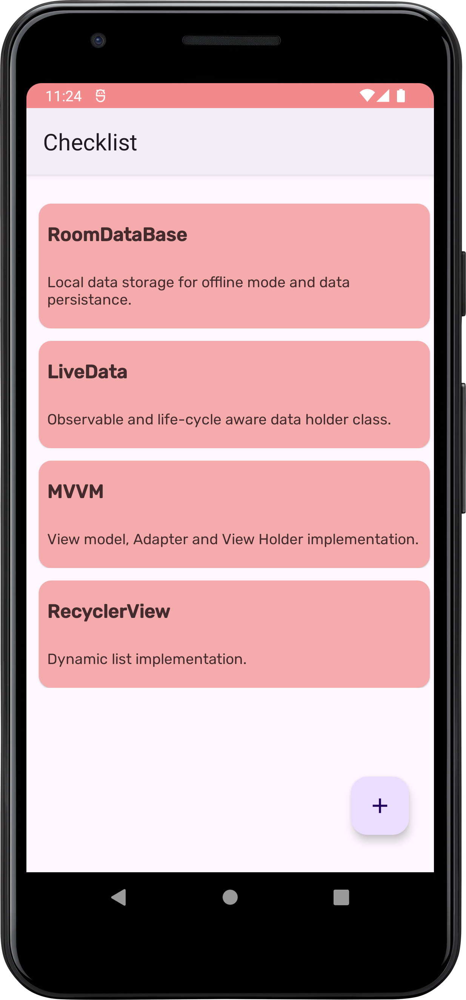
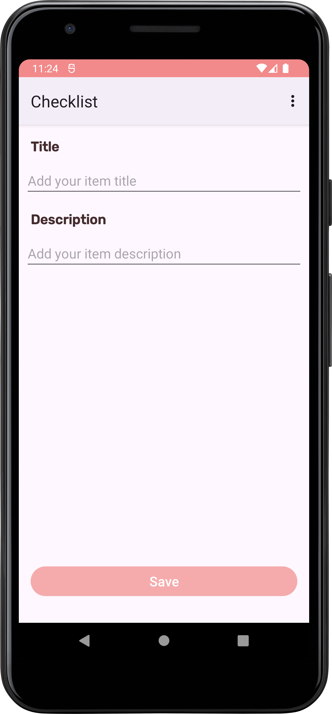

# CheckList
CheckList is an Android application designed to help users manage their tasks efficiently. With CheckList, users can create, edit, and track their tasks easily.

## :camera_flash: Screenshots - Dark Mode
&emsp; 

## :camera_flash: Screenshots - Light Mode
&emsp; 

## Structure
* AppDataBase: Handles the database operations for the application.
* Chore: Represents a task or chore entity.
* ChoreDao: Data Access Object for chore-related database operations.
* CheckListActivity: Main activity displaying the checklist.
* CheckListAdapter: Adapter for populating the checklist items.
* CheckListViewHolder: View holder for the checklist items.
* CheckListViewModel: ViewModel for managing UI-related data.
* ChoreAction.kt: Defines actions related to chores.
* ChoreDetailsActivity: Activity for displaying chore details.
* CheckListApplication: Application class for initializing components.

## Knowledge Stack
* Kotlin
* Android Jetpack Components (ViewModel, Room)
* RecyclerView for displaying the checklist
* LiveData for observing data changes
* Material Design components for UI consistency

## Features
* Create: Users can create new tasks or chores to add to their checklist.
* Edit: Allows users to edit existing tasks to update their details.
* Delete: Users can remove tasks from the checklist once they are completed.
* View Details: Provides detailed information about each task when selected.

